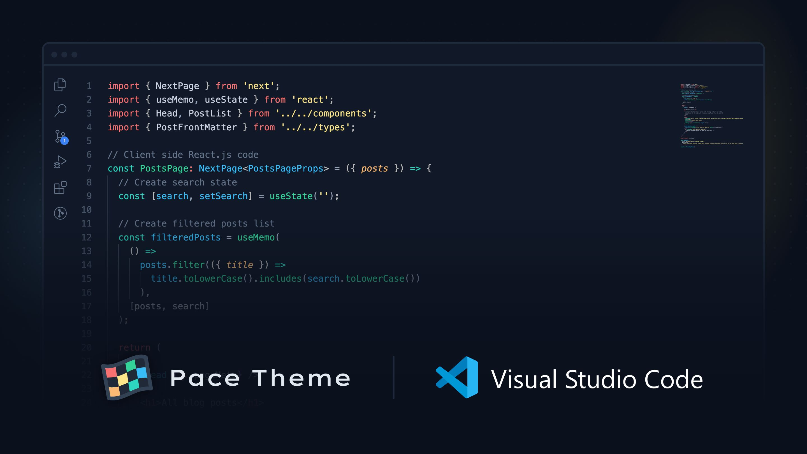
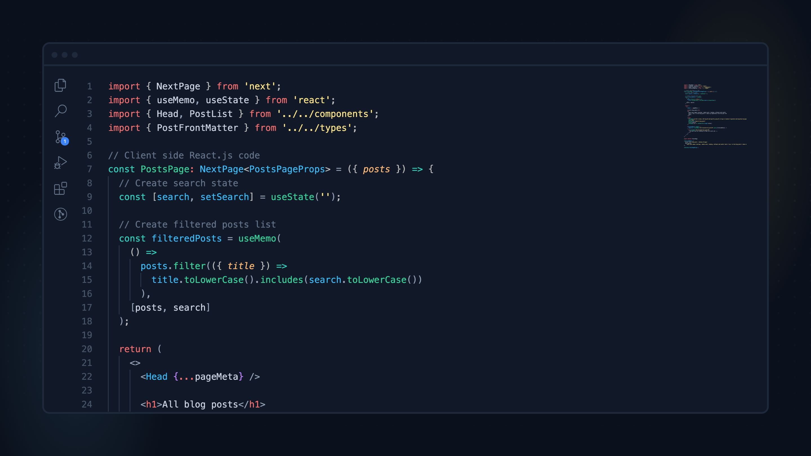
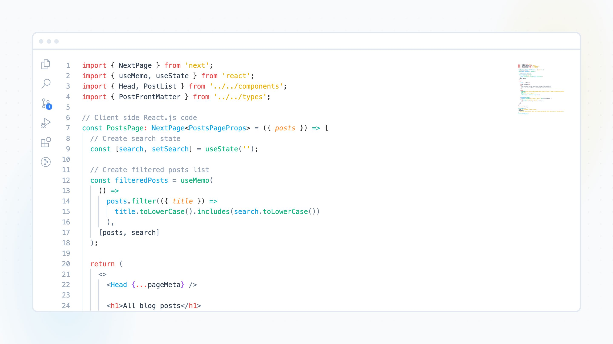

# Pace Theme

An elegant VS Code theme optimized for developers with a high pace.

## Installation

1. Open the extensions sidebar in VS Code
2. Enter `Pace Theme` in the search
3. Select the theme and click on `Install`

## Color Mode

The theme supports dark and light mode.

### Dark Mode

### Light Mode

## Credits

When creating the Pace Theme, I took inspiration from the [One Monokai Theme](https://github.com/azemoh/vscode-one-monokai) I used many years previously and the [Tailwind CSS](https://tailwindcss.com/) color palette.

## License

This theme is released under the [MIT License](./LICENSE.md).
